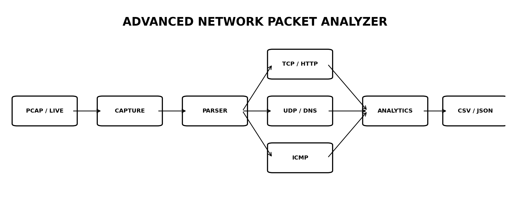

# 🔥 Advanced Network Packet Analyzer



> **Python | Scapy | TCP/IP | PCAP | Protocol Dissection | Network Analytics | CLI | Testing | CI**

A Wireshark-inspired packet analysis toolkit that converts raw packets into structured, queryable records and then produces network-level analytics.

## Supported protocols
- TCP
- UDP
- HTTP (plaintext request metadata)
- DNS
- ICMP

## Packet view
```text
Source IP | Destination IP | Protocol | Port | Packet Size | Info
```

Captured metadata includes timestamp, IPv4 addresses, protocol, ports, packet size, TTL, TCP flags and protocol-specific fields.

## Architecture
```text
PCAP / LIVE INTERFACE
        ↓
     CAPTURE
        ↓
   PROTOCOL PARSER
        ↓
   PacketRecord
        ↓
 ┌──────┼─────────┐
 ↓      ↓         ↓
Stats Conversations Export
 ↓      ↓         ↓
Protocols Endpoints CSV/JSON
Traffic   Ports
Flags
```

## Advanced features
- PCAP-first reproducible analysis
- optional authorised live capture
- TCP flag extraction
- plaintext HTTP method/Host/path extraction
- DNS query/type extraction
- ICMP type/code extraction
- protocol distribution
- traffic volume by protocol
- endpoint conversation analysis
- destination-port analysis
- explainable heuristic flags
- CSV and JSON export
- unit tests
- Ruff linting
- GitHub Actions CI

## Quick start
```bash
pip install -r requirements-dev.txt
python examples/generate_demo_pcap.py
python -m packet_analyzer --pcap pcaps/demo.pcap --csv packets.csv --json packets.json
```

## Live capture
Only inspect an interface you are authorised to monitor:
```bash
python -m packet_analyzer --live <interface> --count 100 --filter "ip"
```

## Example analytics
```text
PROTOCOLS
TCP / UDP / HTTP / DNS / ICMP

TRAFFIC
protocol | packets | bytes

CONVERSATIONS
endpoint A | endpoint B | packets | bytes

HEURISTIC FLAGS
SYN | large-packet | echo-request | sensitive-port
```

Flags are transparent triage indicators, not intrusion-detection verdicts.

## Engineering
Run:
```bash
pytest -q
ruff check .
```
GitHub Actions repeats the tests, generates the synthetic PCAP and runs the analyzer.

## Resume
**Advanced Network Packet Analyzer | Python, Scapy, TCP/IP, PCAP**
> Built a Wireshark-inspired packet analyzer supporting TCP, UDP, HTTP, DNS and ICMP dissection; normalised packet metadata into structured records and implemented protocol/traffic analytics, endpoint conversation analysis, explainable traffic heuristics and CSV/JSON exports with automated testing and CI.

## Interview pitch
> I built a packet-analysis pipeline that starts with a PCAP or authorised interface, dissects protocol layers into a normalised PacketRecord, and then performs protocol, traffic and conversation analytics. I separated parsing from analytics so the system is testable and extensible, and added reproducible PCAP fixtures plus CI.

## Responsible use
Use only on networks and captures you are authorised to inspect. HTTPS payloads are not decrypted, and the project contains no exploitation, credential theft, packet injection or evasion functionality.
